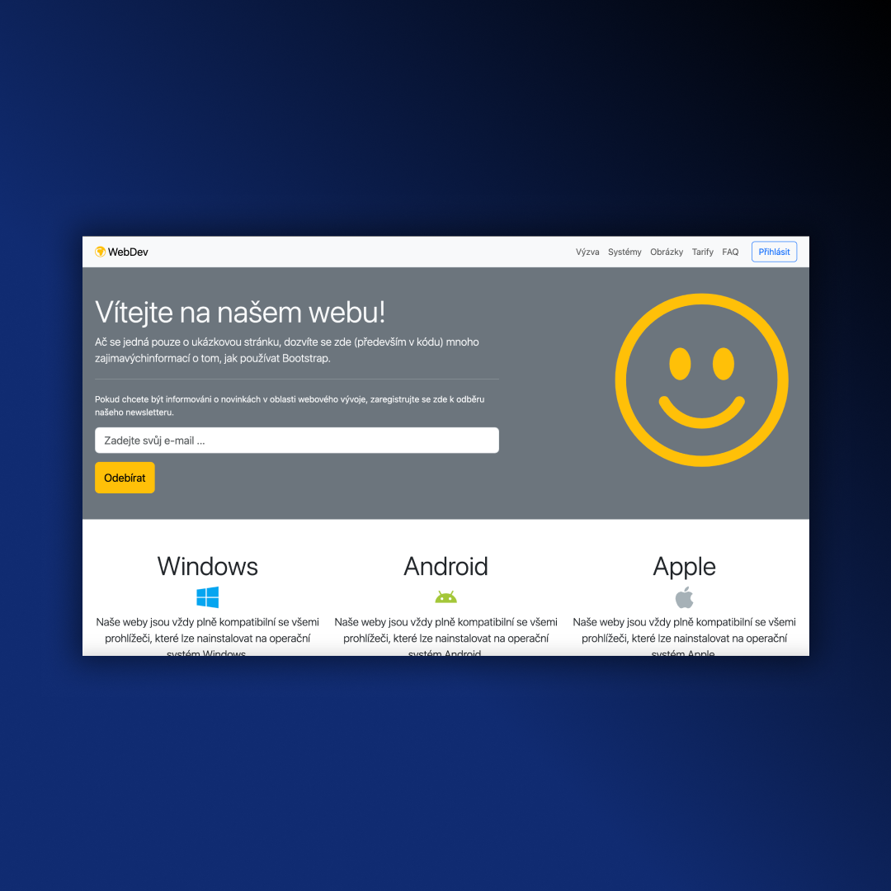
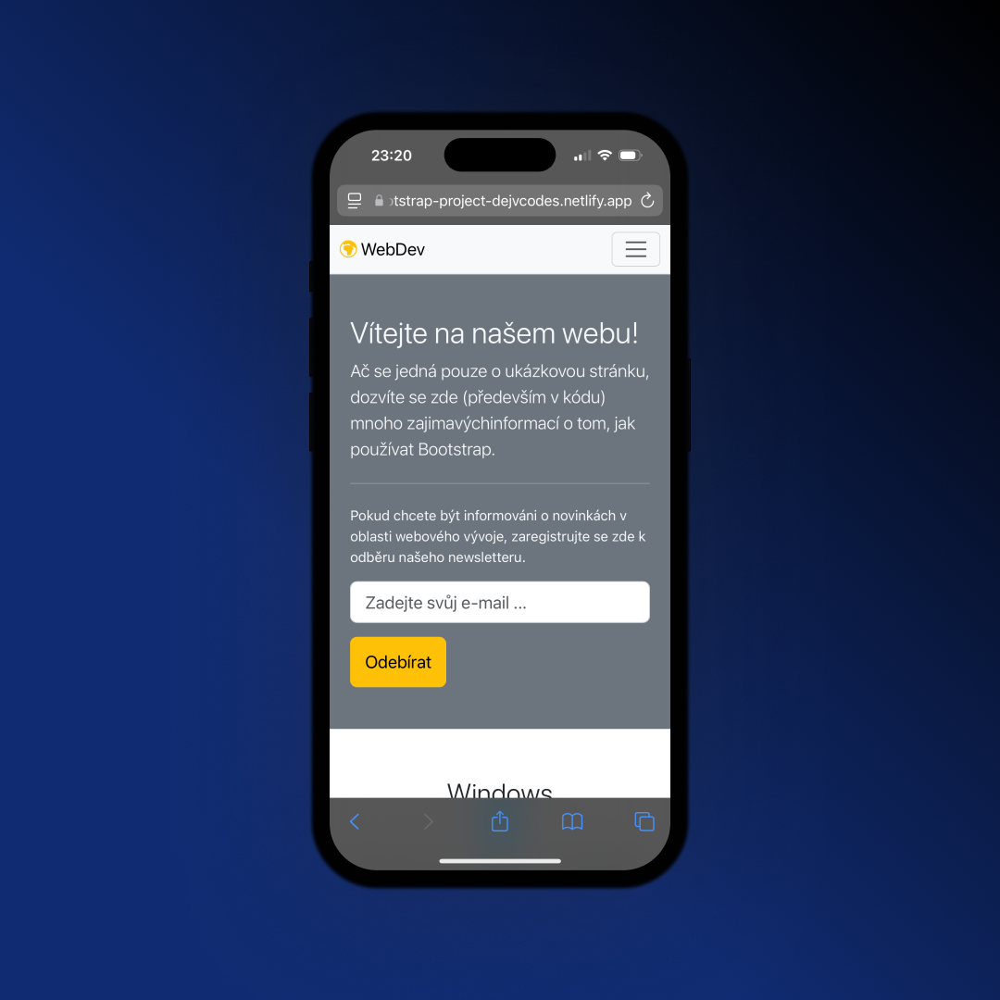

## Bootstrap Project 
• Learning how to work with Bootstrap  
• Responsive Design 

## Screenshots 📱
 

## 💻 Tech Stack

## 🌐 Link
<a href="https://bootstrap-project-dejvcodes.netlify.app/">Bootstrap Project</a>

## License 🔐
[MIT License](LICENSE) 